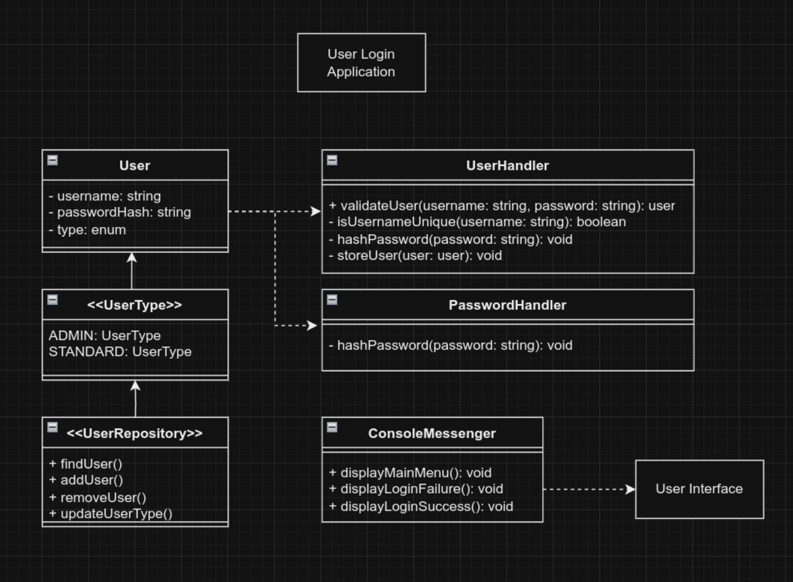

# User Login Application

The system allows standard users to create a user account and login, whilst admin users are able to manage existing users.

The aim was to create a scalable application with user authentication and input validation, along with a database and password hashing functionality and to follow a test-driven development approach.

 

#### Class Diagram

 

<!--
#### Example Test Cases

To-Do
Move logic for login loop
Add User interface
Add UserType enumeration
Create DataHandler (capture and validate methods)
- Potentially add UserController for data handling?

-->
